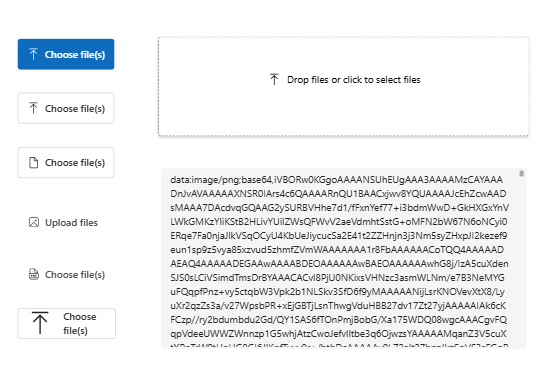

# Power Platform PCF Components

This repository contains a collection of high-quality Power Apps Component Framework (PCF) components designed to enhance your Power Platform applications with modern UI elements and advanced functionality.

## Components

### 📁 [File Uploader](fileUploader)

A flexible file upload component with multiple interface options:

- Standard buttons (primary, secondary, outline, etc.)
- Compound buttons with descriptive text
- Drag-and-drop zone for intuitive file uploads
- File list with preview icons based on file type
- Support for multiple file selection



#### 🚀 File Uploader v2.0 Release Notes (April 2025)

- **Upgraded to FluentUI v9**: Modern design system with improved accessibility and performance
- **Enhanced File State Management**: Fixed issue where files array would reset when dragging new files
- **Improved Type Safety**: Removed usage of `any` types for better code quality and error prevention
- **New Button Types**: Added support for secondary, outline, subtle, and transparent button styles
- **Dynamic Icon Support**: Now using FluentUI v9 icon system with extensive icon library
- **Refined Drag & Drop Experience**: Better visual feedback during drag operations
- **Improved File Preview**: Enhanced preview system with appropriate icons for different file types
- **Better Error Handling**: More robust error management for file operations
- **Performance Optimizations**: Faster file processing with reduced memory usage

### 🃏 [Fluent Cards](fluentCards)

Modern card components using Fluent UI design language for displaying information in a visually appealing way.

### 📜 [Scroll Bar](scrollBar)

Custom scroll bar component for better scrolling experience in Power Apps.

## How to Build

### Prerequisites

- Power Platform CLI
- .NET SDK
- Node.js and npm

### Development Build

```bash
cd \Solution
dotnet msbuild /t:build /restore
```

### Production Build

```bash
cd \Solution
dotnet msbuild /p:configuration=Release /restore
```

## Documentation

For detailed information on working with PCF components, refer to the [official Microsoft documentation](https://learn.microsoft.com/en-us/power-apps/developer/component-framework/import-custom-controls).
