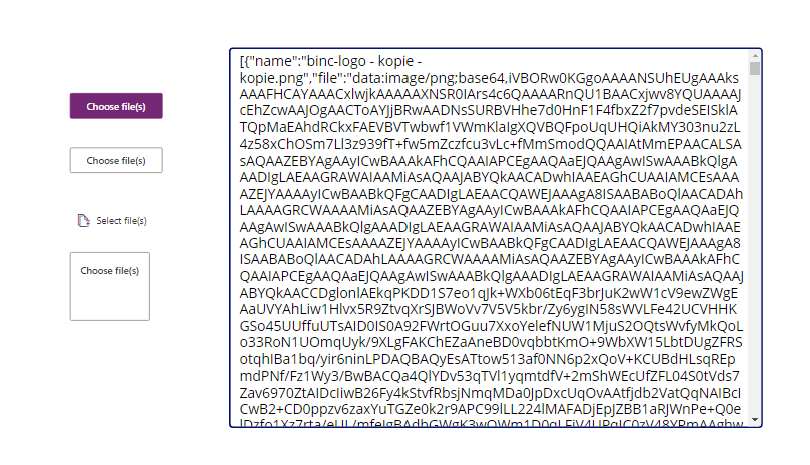
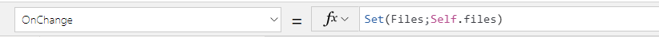
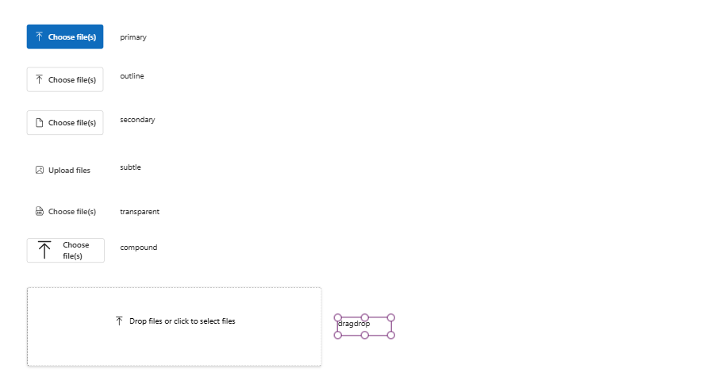

## File Uploader

A generic Fluent UI v9 button to trigger the native file selector. Outputs the selected files as data url.
Uses the theming from your canvas app automatically.



### Breaking Changes in v2.0.0

- Upgraded to FluentUI v9
- Icon names must now follow FluentUI v9 naming convention. Please refer to the [FluentUI Icons Catalog](https://react.fluentui.dev/?path=/docs/icons-catalog--docs) for available icons.
- Button type action and standard are removed and replaced by native fluentui v9 type.
  - primary
  - secondary
  - outline
  - subtle
  - transparent

### How to get selected file data

The OnChange event is triggered when selecting new files.
An array of the data will be available after selecting new files in the "files" parameter.
You can use the onChange event to track changes, and process the file data in e.g. power automate.

e.g.

Example 1


Example 2

```
ForAll(
    ParseJSON(Self.files);
    // Do something with data
    // ThisItem.name
    // ThisItem.file
)
;;
```

### Parameters

#### Label button

Label to show on the button

> Default = "Choose file(s)"

#### Allow multiple files

Allow the user to select multiple files at once

> Default = "true"

#### Allowed formats

Allowed formats to select.

e.g. image/png,image/jpeg

Please refer to [this media type list](http://www.iana.org/assignments/media-types/media-types.xhtml) for file types.

> Default = "all"

#### ID of the button

HTML id of the input field.
May be handy when adding multiple upload buttons.

> Default = "xe-uploadfile-button"

#### Button type

Refers to type of button.

> Default = "primary"

##### Types



Available types:

- primary
- secondary
- outline
- subtle
- transparent
- compound
- dragdrop

#### Action icon

Can be used in combination with any button type.
Refer to the [FluentUI Icons Catalog](https://react.fluentui.dev/?path=/docs/icons-catalog--docs) for available icons.

**Breaking Change in v2**: Icons must use the FluentUI v9 naming convention.

> Default = "ArrowUploadRegular"

#### Trigger Reset

Used to clear the files parameter. Change this value to trigger a reset of the selected files.
Can be any type of value (string, boolean, number) - changing the value is what triggers the reset.

> Default = "0"

#### showFileList

Show or hide the filelist overview

> Default = True

#### Dropzone settings

##### dropFilesText

Text shown in the dropzone

##### dropZoneBorderColor

Border color of the dropzone

##### dropZoneBorderSize

Border size of the dropzone

##### dropZoneTextColor

Text color of the dropzone

#### Files

Array of selected files.
Data url can be used to process files.

```
[
    {
        name: 'name of the file',
        data: 'data url of the file'
    }
]
```
